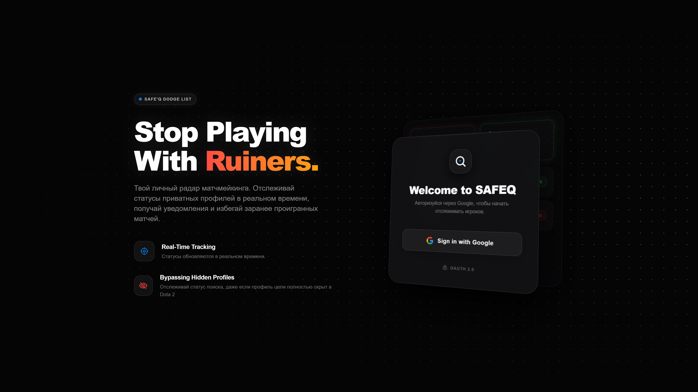
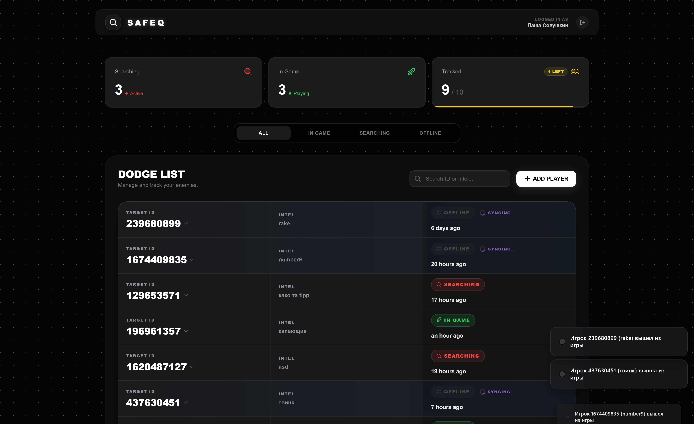
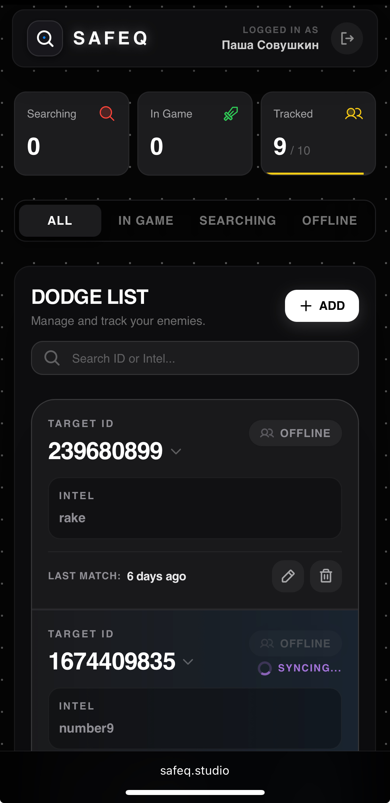
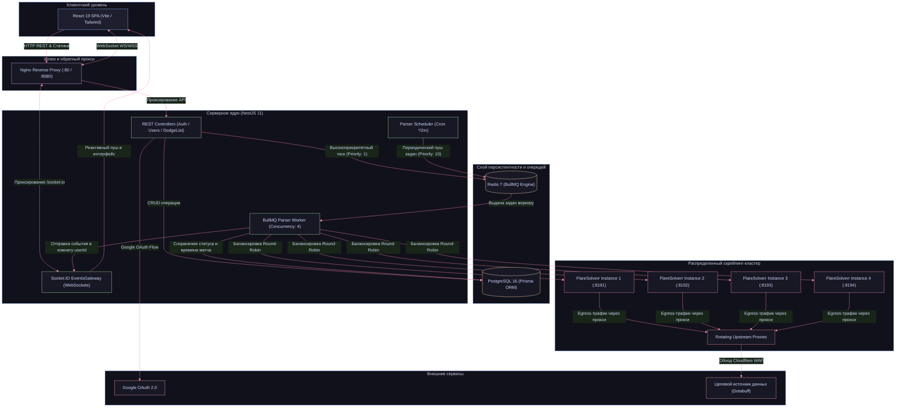

# SAFEQ — Dota 2 Realtime Dodge List & Match Tracking Platform

SAFEQ — распределенная Fullstack-платформа для отслеживания игровых статусов игроков Dota 2 в режиме реального времени. Сервис решает проблему лимитов встроенного внутриигрового черного списка Valve, позволяя формировать расширенный персональный список игроков («додж-лист») с заметками, автоматически определять их активность (в поиске матча, в активной игре, оффлайн) и мгновенно информировать пользователя о входе нежелательного игрока в матчмейкинг.

Платформа полностью развернута в production-инфраструктуре и доступна онлайн:  
**Live Production URL:** [https://safeq.studio/](https://safeq.studio/)

> **Дисклеймер о проприетарности**: Исходный код ядра платформы, алгоритмы обхода защитных механизмов WAF и инфраструктурные конфигурации являются закрытой коммерческой разработкой. Данный публичный репозиторий представляет собой **Engineering Case Study (System Design Showcase)**, раскрывающий концепцию проекта, архитектурную топологию и решения ключевых инженерных вызовов высоконагруженного скрейпинга.

<p align="center">
  
</p>

---

## Интерфейс платформы

### Рабочая панель мониторинга (Desktop)
Полноразмерный тактический дашборд с отображением агрегированных метрик активности, индикатором квоты отслеживаемых слотов (до 10 игроков), фильтрацией по статусам и контекстным меню быстрых переходов к внешней аналитике (Dotabuff, OpenDota, Stratz):

<p align="center">
  
</p>

### Адаптивный мобильный интерфейс (Mobile)
Интерфейс оптимизирован под экраны смартфонов для оперативной проверки игроков и статуса поиска прямо во время стадии драфта в клиенте игры:

<p align="center">
  
</p>

---

## Возможности платформы

- **Персональный додж-лист с квотой до 10 слотов**: Добавление игроков по 32-bit Dota Account ID с сохранением контекстных заметок и даты фиксации. В интерфейсе реализован динамический прогресс-бар квоты (Fair-Use Quota Management), защищающий инфраструктуру от исчерпания ресурсов хоста.
- **Мониторинг статуса в реальном времени**: Автоматическое определение текущего состояния игрока (`SEARCHING`, `PLAYING`, `OFFLINE`) и времени завершения последнего матча.
- **Обход Cloudflare WAF**: Распределенный парсинг аналитических сервисов (Dotabuff) через пул headless-инстансов FlareSolverr с автоматической ротацией сессий и поддержкой upstream-прокси.
- **Очереди с приоритезацией задач**: Архитектура на базе Redis и BullMQ с фоновым регулярным обновлением по расписанию и мгновенным высокоприоритетным парсингом при добавлении нового игрока.
- **WebSocket-пуши (Socket.IO)**: Мгновенная доставка обновлений статусов подключенным клиентам с изоляцией по персональным комнатам пользователей.
- **Безопасная аутентификация**: Авторизация через Google OAuth 2.0 с выдачей криптографически подписанных stateless JWT-токенов.
- **Тактический веб-интерфейс**: Темная адаптивная тема интерфейса, мгновенный поиск, фильтрация по статусам, индикация квот и контекстные ссылки на внешнюю статистику (Dotabuff, OpenDota, Stratz).

---

## Стек технологий

| Слой | Технология | Назначение в проекте |
| :--- | :--- | :--- |
| Frontend | React 19 / TypeScript 5.7 | Клиентское SPA-приложение с декларативным UI |
| Frontend Tooling | Vite 8 / Tailwind CSS 3.4 | Оптимизированный бандлинг и тактическая темная тема |
| Backend Framework | NestJS 11 | Модульная корпоративная серверная архитектура |
| Database | PostgreSQL 16 | Реляционная СУБД с транзакционной целостностью |
| ORM | Prisma ORM 7 | Типобезопасная работа с БД и автоматические миграции |
| Distributed Queues | BullMQ 5 / Redis 7 | Асинхронные очереди с поддержкой приоритетов и ретраев |
| Anti-Bot Engine | FlareSolverr (4x инстанса) | Headless-браузеры Chromium для прохождения Cloudflare JS Challenge |
| Real-time Transport | Socket.IO 4.8 | Дуплексный транспорт с изоляцией комнат пользователей |
| Auth & Security | Passport.js (Google OAuth, JWT) | Безопасная аутентификация и защита маршрутов через Guards |
| Ingress / Web Server | Nginx Alpine | Reverse-proxy, SPA-роутинг и WebSocket connection upgrade |
| Orchestration | Docker / Docker Compose | Мультиконтейнерная изолированная инфраструктура |

---

## Архитектура системы

Платформа спроектирована по сервисно-ориентированной модели с четким разграничением зон ответственности компонентов:



---

## Ключевые инженерные вызовы и их решения

### 1. Преодоление Cloudflare WAF и борьба с утечками памяти Chromium (OOM)

#### Вызов
Сервис Dotabuff защищен Cloudflare WAF, требующим исполнения JavaScript Challenge и валидации сигнатур браузера. Прямые HTTP-запросы мгновенно отклоняются кодом 403. Поднятие постоянных инстансов браузера (Puppeteer/Playwright) в Docker приводит к быстрой деградации памяти и аварийному завершению процессов по OOM-killer.

#### Решение
- **Кластерная архитектура FlareSolverr**: В Docker-сети развернуто 4 изолированных инстанса FlareSolverr, каждый из которых маршрутизирует трафик через собственный upstream-прокси.
- **Балансировка Round-Robin**: На уровне воркера реализован циклический опрос пула инстансов, что исключает точечную перегрузку одного IP-адреса.
- **Управление сессиями и предотвращение OOM**:
  - На каждом инстансе создается именованная сессия (`dotabuff-session`), проходящая JS Challenge один раз и сохраняющая cookies.
  - Установлен лимит `MAX_REQUESTS_PER_SESSION = 35`. По достижении счетчика сессия принудительно перезапускается, очищая внутренние кэши движка Chromium.
  - Контейнерам выделен `shm_size: 256m` и жесткий лимит RAM (`deploy.resources.limits.memory: 768M`), защищающий сервер от истощения системной памяти.
  - При возникновении таймаута инстанс временно исключается из балансировки через мьютекс `_recreatingUrls` и пересоздается без остановки общего пайплайна.

---

### 2. Управление нагрузкой и квотирование ресурсов (Capacity Planning & 10-Player Limit)

#### Вызов
Парсинг защищенных страниц через headless-браузер требует существенных вычислительных ресурсов: один запрос занимает от 4 до 7 секунд. Без строгого ограничения объема отслеживания неограниченный ввод игроков привел бы к насыщению очередей (Queue Saturation), задержкам обновления в десятки минут и перегрузке CPU/RAM хоста.

#### Решение
- **Инженерное обоснование квоты в 10 слотов (`MAX_PLAYERS_LIMIT: 10`)**: 
  - Расчет пропускной способности: кластер из 4 нод FlareSolverr обрабатывает порядка 30–40 страниц в минуту.
  - Лимит в 10 слотов на пользователя гарантирует, что 2-минутный регулярный цикл фонового сбора успевает опросить всех уникальных игроков из базы без отставания очереди.
- **Многоуровневый контроль квоты**:
  - Бэкенд проверяет текущее количество записей перед созданием новой (`dodgeList.count >= limit`) и возвращает структурированную ошибку с кодом 400.
  - Фронтенд визуализирует лимит через интерактивный прогресс-бар в карточке метрик дашборда ("Tracked: X/10") и блокирует форму добавления при исчерпании доступных слотов.
- **Двухуровневая модель приоритетов в BullMQ**:
  - Фоновый цикл (Bulk Sync) выполняется по расписанию раз в 2 минуты (`Cron */2 * * * *`) с низким приоритетом (`priority: 10`).
  - Добавление игрока пользователем (On-Demand Sync) инициирует немедленную задачу с наивысшим приоритетом (`priority: 1`), минуя общую очередь и возвращая статус в течение нескольких секунд.

---

### 3. Реактивная синхронизация состояния и изоляция данных пользователей

#### Вызов
Один и тот же игрок может отслеживаться несколькими независимыми пользователями. При смене статуса необходимо обеспечить моментальную доставку события только заинтересованным клиентам без утечки информации о чужих списках отслеживания.

#### Решение
- **Изоляция комнат Socket.IO**: При авторизации сокета по JWT сервер автоматически помещает клиента в комнату с идентификатором `userId`.
- **Точечная отправка событий**: Воркер обращается к шлюзу `EventsGateway` и пушит события строго в целевую комнату: `this.server.to(userId).emit('player-status-changed', data)`.
- **Реактивный интерфейс**: Кастомный React-хук `useSocket` локально обновляет стейт таблицы без повторного REST-запроса всей таблицы, сопровождая переход статуса анимацией строки и тост-уведомлением (`react-hot-toast`).

---

### 4. Инфраструктурная безопасность и DevSecOps-практики

#### Решение
- **Изоляция сетевого периметра**: Порты PostgreSQL и Redis закрыты внутри Docker-сети и не доступны из внешней сети (порт Postgres привязан строго к `127.0.0.1` для обслуживания локальных миграций).
- **Rate Limiting**: Защита эндпоинтов API от брутфорса и DoS через `@nestjs/throttler` (лимит 30 запросов в 10 секунд на IP-клиента).
- **Безопасный OAuth Flow**: Google OAuth 2.0 с валидацией редиректа по белому списку `FRONTEND_URL` (защита от Open Redirect атак) и выдачей stateless JWT.
- **Nginx Ingress**: Единая входная точка, терминация соединений, кэширование статики и проксирование WebSocket соединений (`Connection "upgrade"`).

---

## Архитектура базы данных

Схема данных оптимизирована под минимальный объем избыточности с гарантией целостности на уровне СУБД:

```
[User] (id, googleId, email, username, createdAt)
   │
   └── 1 : N ──┐
               ▼
       [DodgeRecord] (id, dotaId, note, status, lastMatchTime, createdAt, userId)
       * Composite Unique Constraint: @@unique([userId, dotaId])
```

- Ограничение `@@unique([userId, dotaId])` исключает повторное добавление одного и того же игрока одним пользователем.
- Перечисление `Status` (`OFFLINE`, `PLAYING`, `SEARCHING`) типизировано на уровне PostgreSQL.

---

## Статус проекта и Roadmap

Платформа успешно функционирует в production-контуре. Дальнейшие этапы развития:
- Интеграция биллинговой системы для покупки расширенных пакетов квот (увеличение слотов с 10 до 50/100 игроков с динамическим масштабированием пула нод FlareSolverr).
- Разработка Telegram-бота для мгновенных push-уведомлений о старте поиска матча отслеживаемым игроком.
- Подключение дополнительных аналитических провайдеров и прямой интеграции со Steam Web API.
